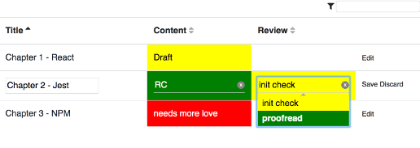

# justalist
very simple full-stack app displaying a list of work items (like chapters of a publication or features for a release, or status of systems or ... - helping creative teams to deliver in time). I started this to test-drive Web technolgoies beyond the current project. Nothing is in here that a spreadsheet could not do and it's not remotely as powerful as one of the cool work management tools out there - but simple (in fact: ultra-simple), versatile and nice ;-)

Some things that are in so far: 

* *React* / *Redux* (/ *Thunks*) (based on *create-react-app*)
* extensive testing w/ *Jest* & the amazing *unexpected* 4 really helpful diffs in assertions
* table component w/ custom editors, external sort/filter
* own choice / dropdown component (w/ *D3-color, :focus-within*)
* receive websocket-based updates as soon as sth is written in the backend

for server part see [justalistsrv](https://github.com/sebastianrothbucher/justalistsrv)
